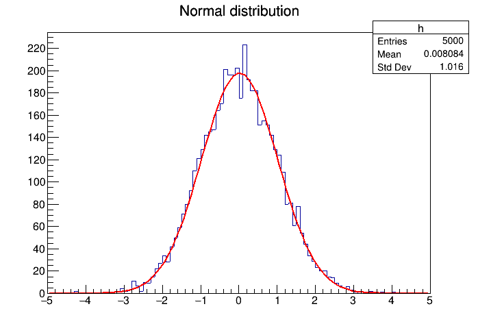

# WrapIt! ROOT example

## Introduction

This directory contains an advanced usage example of WrapIt!. You will also find examples, that write and read TTree, in [TTree_examples](TTree_examples).

The [ROOT](https://root.cern.ch/) software is a central software framework in High energy physics research developed in C++ at [CERN](http://www.cern.ch). The framework has some similarities with Julia although it is not a programming language: its provide a REPL with a C++ interpreter based on [LLVM](http://llvm.org); like Julia it can also be used from Jupyter notebooks. It has a Python interface, [PyROOT](https://root.cern.ch/manual/python/) which is very popular among the physicist. The [ROOT.jl](https://github.com/JuliaHEP/ROOT.jl) provides an interface for old Julia versions (<=1.3.0) using the [Cxx.jl](https://github.com/JuliaInterop/Cxx.jl) interface. 

In this example, we will use ROOT library functionalities from Julia via an interface generated with WrapIt!.

We will create a histogram, fill it with random numbers drawn according to a normal distribution, fit the histogram, plot the result --shown in the image below--, display it on screen and save the result  in a ROOT-format file. All of these actions will be done using the ROOT library.



## Prerequisite

This example needs to have the ROOT software [installed](https://root.cern/install/) on your computer or have access to it via [cvmfs](https://cernvm.cern.ch/fs/).

Depending on the installation mode, you may need to source the `thisroot.sh` to set up your shell environment and provide access to the ROOT binaries.

## Code generation and compilation of the shared library

```
make all
```

💡 The above command runs WrapIt! to generate the c++ code with the command:
```
wrapit ROOT.wit
```
and then it builds the shared library from the generated `jlROOT.cxx` file.

## Use of the wrapper.

As the package is not installed in the system and is only in the current directory, you need to add this directory to the LD_LIBRARY_PATH (used for the shared library) and JULIA_LOAD_PATH (used for the Julia module) environment variable. You can source the `setup.sh` files (`setup.csh` if your shell is tcsh or csh) to perform this.

```
source setup.sh
```

Note: when plotting a new histogram, you may need to click on the graphics to update the display.

The usage example can be found in the [demo_ROOT.jl](demo_ROOT.j) file reproduced below.


```julia
#Import the module.
# The iROOT module is required for interactive graphic display
# Loading the package trigger a loop that process ROOT graphic events.
using ROOT
using iROOT

# Create a ROOT histogram, fill it with random events, and fit it.
h = ROOT.TH1D("h", "Normal distribution", 100, -5., 5.)
ROOT.FillRandom(h, "gaus")

#Draw the histogram on screen
c = ROOT.TCanvas()
ROOT.Draw(h)

#Fit the histogram wih a normal distribution
ROOT.Fit(h, "gaus")

#Save the Canvas in an image file
ROOT.SaveAs(c, "demo_ROOT.png")

#Save the histogram and the graphic canvas in the demo_ROOT_out.root file.
f = ROOT.TFile!Open("demo_ROOT_out.root", "RECREATE")
ROOT.Write(h)
ROOT.Write(c)
Close(f)
```
